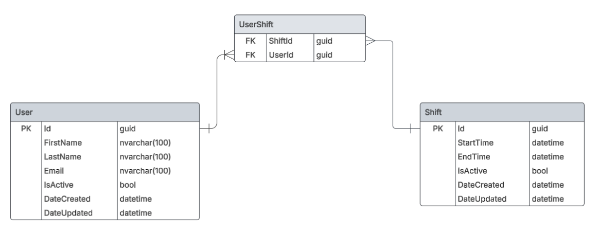

    
    <h1>Shifts Logger</h1>

This is a .NET application for tracking employee working hours. It allows users to assign and track workers shifts.

The backend is a .NET Web API that provides endpoints for managing database records. Frontend is a .NET Console Application for user interaction.

## Table of Contents

- [Features](#features)
- [Technologies](#technologies)
- [Getting Started](#getting-started)
  - [Prerequisites](#prerequisites)
  - [Installation](#installation)
  - [Running the application](#running-the-application)
- [Database Schema](#database-schema)
- [WebApi Project Structure](#webapi-project-structure)
  - [Multi-Layer Architecture](#multi-layer-architecture)
  - [Dependency Injection](#dependency-injection)
  - [Model types](#model-types)
- [Contributing](#contributing)
- [Contact](#contact)

## Features

- **User management**: Create, delete and edit employee information.
- **Shifts management**: Create, delete and edit shifts. Assign or remove workers from shifts and preview working hours.
- **Data seeding**: Provides the option to add fake data for demonstration.

## Technologies

- **.NET 9**: The latest .NET version.
- **Entity Framework Core**: Database management and ORM.
- **SQL Server**: Main database system.
- **Automapper**
- **Refit**
- **xUnit**: Unit and integration tests.

## Getting Started

> [!NOTE]
> The `InitialCreate` migration was created.
>
> It will be applied on startup of the API application and create the database and tables.

### Prerequisites

- .NET 9 SDK
- A code editor like Visual Studio or Visual Studio Code
- SQL Server
- SQL Server Management Studio (optional)

### Installation

1. Clone the repository
   - `https://github.com/nwdorian/ShiftsLogger.git`
2. Configure the appsettings.json
   - Update the connection string
3. Navigate to the API project folder
   - `cd .\WebApi`
4. Build the Web API application using .NET CLI
   - `dotnet build`
5. Navigate to the Console project folder
   - `cd .\ConsoleUI`
6. Build the Console application using the .NET CLI
   - `dotnet build`

### Running the application

1. Run the API application from the API project folder using the .NET CLI
    - `cd .\WebApi\ShiftsLogger.WebApi`
    - `dotnet run`
2. Run the Console application from the Console project folder using the .NET CLI
    - `cd .\ConsoleUI\ShiftsLogger.ConsoleUI`
    - `dotnet run`

## Database Schema

## WebApi Project Structure

### Multi-Layer Architecture

- **Data Access Layer**
  - *ShiftsLogger.DAL*
  - Contains DbContext, entity models, migrations and EF Core configuration files
  - EF Core Configuration
    - Fluent API allows configuration to be specified without modifying entity classes
    - Configurations are extracted to a separate class and loaded with assembly scanning

- **Repository Layer**
  - *ShiftsLogger.Repository* project contains classes for database communication
  - *ShiftsLogger.Repository.Common* project contains interfaces used by dependency injection
  - References *ShiftsLogger.DAL* for obtaining database interaction methods
  - References *ShiftsLogger.Repository.Common* for interface implementation

- **Service Layer**
  - *ShiftsLogger.Service* project has classes which contain business logic
  - *ShiftsLogger.Service.Common* project contains interfaces used by dependency injection
  - References *ShiftsLogger.Service.Common* for interface implementation
  - References *ShiftsLogger.Repository.Common* for dependency injection

- **WebApi Layer**
  - *ShiftsLogger.WebApi* contains REST models and controller classes which handle HTTP requests and responses
  - References *ShiftsLogger.Service.Common* for dependency injection

- **Models Layer**
  - *ShiftsLogger.Models* defines models used in the application
  - Can be referenced by any projects that use the models

- **Common Layer**
  - *ShiftsLogger.Common* contains generic and extension methods, validation, constants, etc.
  - Can be referenced by any project

### Dependency Injection

- Autofac modules are used for registering layer components
- Data Access, Repository and Service layer each contain a module where classes are registered to the Autofac IoC container trough their interfaces
- *ShiftsLogger.Root* project acts as a thin layer that composes modules. It serves as the composition root, handling the registration of all modules without exposing the implementation details to the WebApi project.

### Model types

- **Entity models**
  - located in DAL project
  - represent database tables
  - used for database configuration and interaction
- **DTOs**
  - located in Models project
  - models used inside services for business logic
- **REST models**
  - located in WebApi project
  - format the data exposed to clients that consume the API
  - allow modification of internal model types without impacting API consumers

## Contributing

Contributions are welcome! Please fork the repository and create a pull request with your changes. For major changes, please open an issue first to discuss what you would like to change.

## Contact

For any questions or feedback, please open an issue.
